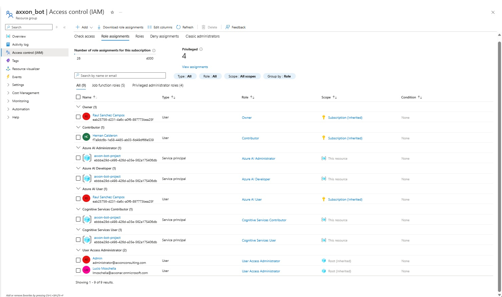

# Axxon AI Assistant

Asistente de inteligencia artificial para Axxon con soporte de chat por texto y conversacion por voz en tiempo real con avatar visual. Utiliza Azure AI Foundry como motor de IA, Azure Voice Live para el modo de voz, y Azure Photo Avatar (VASA-1) para la representación visual del agente.

## Descripcion General

Axxon AI Assistant es una aplicacion web que permite a los usuarios interactuar con un agente de IA de dos formas:

- **Modo Texto**: El usuario escribe mensajes y recibe respuestas del agente en formato texto a traves de WebSocket.
- **Modo Voz con Avatar**: El usuario habla por microfono y recibe respuestas habladas del agente en tiempo real, con transcripciones visibles en el chat. Durante la conversación, un avatar visual (Camila) aparece en un popup flotante mostrando sincronización labial (lip-sync) en tiempo real vía WebRTC.

La aplicacion soporta multiples usuarios simultaneos, cada uno con su propia sesion independiente.

## Arquitectura

```
                          +---------------------------+
                          |     Azure AI Foundry      |
                          |  (Agente + AI Search)     |
                          +--------+--------+---------+
                                   |        |
                          SDK      |        |  SDK
                     (conversations|        |(voice live)
                      + responses) |        |
                                   |        |
+----------------+    WebSocket  +-+------+ +-+--------+
|   Frontend     |<------------>| :8000  | | :8001    |
|  React.js      |    (texto)   | Texto  | |  Voz     |
|  (Vite)        |<------------>| Server | | Server   |
|  :5173 / :80   |  (voz+audio) +--------+ +----------+
+----------------+
```

### Flujo de Texto

1. El frontend abre una conexion WebSocket al servidor de texto (puerto 8000)
2. Envia un mensaje `init` con el `user_id` para iniciar la sesion
3. El servidor crea una conversacion en Azure AI Foundry
4. El usuario envia mensajes de texto, el servidor los procesa con el agente y devuelve las respuestas

**Protocolo WebSocket (texto):**
```
Cliente -> Servidor:  { "type": "init", "user_id": "uuid" }
Servidor -> Cliente:  { "type": "session_ready", "conversation_id": "..." }
Cliente -> Servidor:  { "type": "message", "message": "Hola" }
Servidor -> Cliente:  { "type": "bot_message", "text": "Respuesta del agente" }
```

### Flujo de Voz

1. El frontend abre una conexion WebSocket al servidor de voz (puerto 8001)
2. Envia un mensaje `init_voice` con el `user_id`
3. El servidor establece una sesion con Azure Voice Live SDK
4. El audio del microfono se captura como PCM 16-bit mono 24kHz y se envia en binario
5. El servidor responde con audio binario (respuesta hablada) y eventos JSON (transcripciones)

**Protocolo WebSocket (voz):**
```
Cliente -> Servidor:  { "type": "init_voice", "user_id": "uuid", "avatar": true }
Servidor -> Cliente:  { "type": "voice_session_ready" }

# Signaling WebRTC para avatar (si avatar: true)
Servidor -> Cliente:  { "type": "avatar_ice_servers", "ice_servers": [...] }
Cliente -> Servidor:  { "type": "avatar_offer", "sdp": "<base64-encoded-offer>" }
Servidor -> Cliente:  { "type": "avatar_answer", "sdp": "<base64-encoded-answer>" }

# Audio y transcripciones
Cliente -> Servidor:  [ArrayBuffer - PCM audio del microfono]
Servidor -> Cliente:  [ArrayBuffer - PCM audio de respuesta] (solo sin avatar)
Servidor -> Cliente:  { "type": "user_transcript", "text": "..." }
Servidor -> Cliente:  { "type": "agent_text", "text": "..." }
Servidor -> Cliente:  { "type": "agent_transcript", "text": "..." }
Servidor -> Cliente:  { "type": "input_audio_buffer.speech_started" }

# Control
Cliente -> Servidor:  { "type": "response.cancel" }  (interrumpir respuesta)
Cliente -> Servidor:  { "type": "avatar_failed" }  (fallback a audio WebSocket)
Cliente -> Servidor:  { "type": "stop_voice" }  (finalizar sesion)
```

**Nota:** Cuando el avatar está activo, el audio y video llegan vía WebRTC (no por WebSocket) para lograr sincronización labial perfecta.

**Especificaciones de Audio:**
- Formato: PCM 16-bit signed, little-endian
- Canales: Mono (1 canal)
- Sample rate: 24,000 Hz
- Tamano de buffer: 4096 frames

## Estructura del Proyecto

```
axxon-bot-project/
├── README.md
├── CLAUDE.md
├── .gitignore
│
├── frontend/                                # App React.js (Vite)
│   ├── Dockerfile                           # Multi-stage: Node build + Nginx
│   ├── nginx.conf                           # Config Nginx para SPA + health check
│   ├── azure-setup.sh                       # Setup inicial en Azure Container Apps
│   ├── deploy.sh                            # Re-deploy automatizado
│   ├── package.json
│   ├── vite.config.js
│   ├── index.html
│   └── src/
│       ├── App.jsx                          # Componente principal (orquestador)
│       ├── utils/
│       │   └── userId.js                    # Genera user_id unico por tab
│       ├── hooks/
│       │   ├── useTextWebSocket.js          # Hook WebSocket texto (configurable)
│       │   ├── useVoiceWebSocket.js         # Hook WebSocket voz (configurable)
│       │   ├── useAvatarWebRTC.js           # Hook WebRTC para avatar
│       │   └── useAudioPlayback.js          # Hook reproduccion audio PCM
│       └── components/
│           ├── Header.jsx / Header.css
│           ├── ChatWindow.jsx / ChatWindow.css
│           ├── MessageBubble.jsx / MessageBubble.css
│           ├── InputBar.jsx / InputBar.css
│           └── AvatarStage.jsx / AvatarStage.css  # Popup flotante con video del avatar
│
├── backend/                                 # Servidores Python (FastAPI + uvicorn)
│   ├── .env                                 # Variables de entorno (NO se sube a git)
│   ├── requirements.txt                     # Dependencias pip
│   ├── text/
│   │   ├── agent_text_web_socket.py         # Servidor WebSocket texto (puerto 8000)
│   │   ├── Dockerfile                       # Imagen Docker para texto
│   │   ├── azure-setup.sh                   # Setup inicial en Azure
│   │   ├── deploy.sh                        # Re-deploy automatizado
│   │   └── set-credentials.sh               # Configura credenciales del Service Principal
│   ├── voice/
│   │   ├── voice_live_manager.py            # Clase VoiceLiveSession (Azure Voice Live)
│   │   ├── voice_live_server.py             # Servidor WebSocket voz (puerto 8001)
│   │   ├── Dockerfile                       # Imagen Docker para voz
│   │   ├── azure-setup.sh                   # Setup inicial en Azure
│   │   ├── deploy.sh                        # Re-deploy automatizado
│   │   └── set-credentials.sh               # Configura credenciales del Service Principal
│   ├── test/
│   │   ├── test_agent_text_web_socket.html  # Cliente de prueba HTML (texto)
│   │   └── test_agent_voice_web_socket.html # Cliente de prueba HTML (voz)
│   └── help/
│       ├── agent_voice_live.py              # Cliente standalone voz (mic + altavoces)
│       └── use_existing_agent.py            # Script CLI para chat (standalone)
```

## Stack Tecnologico

### Backend
| Tecnologia | Uso |
|---|---|
| Python 3.14 | Runtime del backend |
| uv | Gestor de paquetes y entorno virtual |
| FastAPI | Framework web para endpoints y WebSockets |
| uvicorn | Servidor ASGI |
| azure-ai-projects 2.0.0b3 | SDK de Azure AI Foundry (agentes, conversaciones) |
| azure-ai-voicelive >= 1.2.0b4 | SDK de Azure Voice Live (voz en tiempo real) |
| azure-identity | Autenticacion con Azure (DefaultAzureCredential) |
| openai 2.15.0 | Cliente OpenAI para API de conversaciones |

### Frontend
| Tecnologia | Uso |
|---|---|
| React 19 | Framework de UI |
| Vite 8 | Build tool y dev server |
| Web Audio API | Captura de microfono y reproduccion de audio |
| WebSocket API | Comunicacion en tiempo real con los backends |
| CSS puro | Estilos (dark theme, sin librerias externas) |

### Deployment
| Tecnologia | Uso |
|---|---|
| Docker | Contenedores para cada servicio |
| Azure Container Apps | Hosting en la nube (3 container apps) |
| Azure Container Registry | Registro privado de imagenes Docker |
| Nginx | Servidor web para el frontend en produccion |

## Requisitos Previos

### Servicios de Azure
- **Azure AI Foundry**: Proyecto con un agente configurado
- **Azure AI Search**: Indice RAG multi-modal (para busqueda de conocimiento)
- **Azure Voice Live**: Endpoint de servicio de voz en tiempo real
- **Service Principal**: App registration en Microsoft Entra ID con los roles necesarios (ver seccion de Autenticacion)

### Software Local
- **Python 3.14+** con [uv](https://docs.astral.sh/uv/) instalado
- **Node.js 18+** con npm
- **Azure CLI** (`az login` ejecutado para autenticacion)
- **Docker Desktop** (necesario para deployment en la nube)

## Configuracion

### 1. Variables de Entorno

Crear un archivo `backend/.env` con las siguientes variables:

```env
# Azure AI Foundry - Modo Texto
FOUNDRY_PROJECT_ENDPOINT=https://tu-proyecto.services.ai.azure.com
MODEL_DEPLOYMENT_NAME=gpt-5.2-chat
AI_SEARCH_CONNECTION_NAME=nombre-conexion-search
AI_SEARCH_INDEX_NAME=nombre-indice-rag

# Azure Voice Live - Modo Voz
VOICELIVE_ENDPOINT=wss://tu-endpoint-voice.azure.com

# Azure Avatar - Modo Voz Visual
AVATAR_CHARACTER=Camila                     # Personaje del avatar (Camila, Lisa, etc.)
AVATAR_MODEL=vasa-1                         # Modelo de avatar (vasa-1)

# Agente
AZURE_AGENT_NAME=axxon-agent
PROJECT_NAME=nombre-proyecto-foundry
```

> **Nota:** No se utilizan API keys para desarrollo local. La autenticacion se realiza a traves de `DefaultAzureCredential` que usa `az login` automaticamente.

### 2. Instalacion del Backend

```bash
cd backend
uv pip install -r requirements.txt
```

### 3. Instalacion del Frontend

```bash
cd frontend
npm install
```

## Ejecucion Local (Desarrollo)

Se necesitan tres terminales para ejecutar la aplicacion completa:

### Terminal 1 - Servidor de Texto (puerto 8000)
```bash
cd backend
uv run text\agent_text_web_socket.py
```

### Terminal 2 - Servidor de Voz (puerto 8001)
```bash
cd backend
uv run voice\voice_live_server.py
```

### Terminal 3 - Frontend (puerto 5173)
```bash
cd frontend
npm run dev
```

Abrir http://localhost:5173 en el navegador.

> En modo desarrollo, el frontend se conecta automaticamente a `ws://localhost:8000` (texto) y `ws://localhost:8001` (voz).

## Ejecucion con Docker (Local)

Para probar los contenedores localmente antes de deployar a Azure. Requiere Docker Desktop corriendo.

### Backend - Servidor de Texto
```bash
cd backend
docker build -f text/Dockerfile -t axxon-text-api .
docker run --env-file .env -p 8000:8000 axxon-text-api
```

### Backend - Servidor de Voz
```bash
cd backend
docker build -f voice/Dockerfile -t axxon-voice-api .
docker run --env-file .env -p 8001:8001 axxon-voice-api
```

### Frontend
```bash
cd frontend
docker build \
  --build-arg VITE_TEXT_WS_URL=ws://localhost:8000/ws/chat \
  --build-arg VITE_VOICE_WS_URL=ws://localhost:8001/ws/voice \
  -t axxon-frontend .
docker run -p 5173:80 axxon-frontend
```

Abrir http://localhost:5173 en el navegador.

> **Nota:** Los Dockerfiles del backend usan `backend/` como build context (`docker build -f text/Dockerfile .`), no la subcarpeta. El Dockerfile del frontend usa `frontend/` como build context.

## Deployment en Azure Container Apps

### Arquitectura en la Nube

```
Azure Container Apps Environment (axxon-environment)
├── axxon-assistant-text-api    (puerto 8000, WebSocket texto)
├── axxon-assistant-voice-api   (puerto 8001, WebSocket voz)
└── axxon-assistant-frontend    (puerto 80, Nginx + React)
```

Los tres servicios comparten el mismo Resource Group (`axxon-container-rg`), Container Registry (`axxonregistrytext`) y Environment (`axxon-environment`).

### Autenticacion en Azure (Service Principal)

Los backends en Azure no tienen acceso a `az login`, por lo que necesitan un **Service Principal** para autenticarse con Azure AI Foundry.

#### 1. Crear App Registration

En Azure Portal > **Microsoft Entra ID** > **App registrations** > **New registration**:
- Nombre: `axxon-bot-project`
- Tipo de cuenta: "My organization only"
- Crear un **Client Secret**: App registration > Certificates & secrets > New client secret

#### 2. Permisos de la App Registration (API Permissions)

Ademas de los roles IAM, la App Registration necesita permisos de API para acceder a los servicios de Azure AI.

En Azure Portal > **Microsoft Entra ID** > **App registrations** > seleccionar la app > **API permissions** > **Add a permission**, agregar los permisos necesarios para Azure Cognitive Services y Azure AI Foundry:



> **Que son los API Permissions?** Son los permisos que le otorgas a tu aplicacion (Service Principal) para llamar a las APIs de Microsoft. Sin estos permisos, aunque el Service Principal tenga roles IAM asignados, las llamadas a la API de Azure AI Foundry seran rechazadas con un error 403. Hay dos tipos:
> - **Delegated permissions**: El servicio actua en nombre de un usuario (requiere que el usuario haya iniciado sesion). Se usan en apps con login interactivo.
> - **Application permissions**: El servicio actua con su propia identidad, sin usuario. Son los que se usan para backends y servicios automatizados como este proyecto.
>
> En este proyecto se usan **Application permissions** porque los backends de Python corren sin intervencion del usuario (autenticacion no interactiva con `ClientSecretCredential`).

Despues de agregar los permisos, un administrador del tenant debe hacer clic en **"Grant admin consent for [organizacion]"** para que los permisos queden activos. Sin este paso, los permisos quedan en estado "Not granted" y las llamadas a la API fallaran.

#### 3. Asignar Roles al Service Principal (IAM)

En el recurso **Azure AI Services** (ej: `axxon-bot-services`) y en el **Foundry Project** (ej: `proj-axxon-bot`), ir a **Access control (IAM)** > **Add role assignment** y asignar al Service Principal:

| Rol | Proposito |
|---|---|
| **Azure AI Developer** | Permite crear conversaciones y usar agentes (data actions de AI Foundry) |
| **Cognitive Services User** | Permite ejecutar APIs de OpenAI/conversations (data plane) |
| **Cognitive Services Contributor** | Permite gestionar el recurso de Cognitive Services |
| **Azure AI Administrator** | Administracion general del recurso AI |

> **Importante:** Los roles deben estar asignados directamente en el recurso de AI Services y/o en el Foundry Project, no solo a nivel de Resource Group. La propagacion de roles puede tardar 5-10 minutos.

#### 4. Configurar credenciales en los Container Apps

Editar los archivos `backend/text/set-credentials.sh` y `backend/voice/set-credentials.sh` con las credenciales del Service Principal:

```bash
AZURE_TENANT_ID="tu-tenant-id"          # Microsoft Entra ID > Overview > Tenant ID
AZURE_CLIENT_ID="tu-client-id"          # App registration > Application (client) ID
AZURE_CLIENT_SECRET="tu-client-secret"  # App registration > Certificates & secrets > Value
```

Ejecutar desde `backend/`:
```bash
bash text/set-credentials.sh     # Configura credenciales en el Container App de texto
bash voice/set-credentials.sh    # Configura credenciales en el Container App de voz
```

> **Seguridad:** Los archivos `set-credentials.sh` estan excluidos del git (`.gitignore`) para no subir secrets al repositorio.

### Orden de Deployment

**Paso 1: Deployar los backends** (desde `backend/`)
```bash
cd backend

# Setup inicial del servidor de texto (crea RG, ACR, Environment si no existen)
bash text/azure-setup.sh

# Setup inicial del servidor de voz (reutiliza RG, ACR, Environment)
bash voice/azure-setup.sh
```

**Paso 2: Configurar credenciales del Service Principal**
```bash
cd backend

# Configurar AZURE_TENANT_ID, AZURE_CLIENT_ID, AZURE_CLIENT_SECRET
bash text/set-credentials.sh
bash voice/set-credentials.sh
```

**Paso 3: Deployar el frontend** (desde `frontend/`)
```bash
cd frontend

# Setup inicial (pide las URLs de los backends, construye y deploya)
bash azure-setup.sh
```

**Paso 4: Actualizar CORS en los backends**

El script del frontend muestra los comandos al final. Ejecutar:
```bash
# Agregar la URL del frontend como origen permitido en ambos backends
az containerapp update --name axxon-assistant-text-api \
  --resource-group axxon-container-rg \
  --set-env-vars "ALLOWED_ORIGINS=https://axxon-assistant-frontend.<region>.azurecontainerapps.io"

az containerapp update --name axxon-assistant-voice-api \
  --resource-group axxon-container-rg \
  --set-env-vars "ALLOWED_ORIGINS=https://axxon-assistant-frontend.<region>.azurecontainerapps.io"
```

### Re-deployment (actualizaciones)

Despues del setup inicial, para actualizar cada servicio:

```bash
# Desde backend/
bash text/deploy.sh          # Re-deploy servidor de texto
bash voice/deploy.sh         # Re-deploy servidor de voz

# Desde frontend/
bash deploy.sh               # Re-deploy frontend (obtiene URLs de backends automaticamente)
```

> **Nota:** No es necesario volver a ejecutar `set-credentials.sh` en re-deployments, las variables de entorno persisten.

### Variables de Entorno en Azure

Las variables sensibles se configuran como **secrets** en Azure Container Apps (no se usa archivo `.env`):

| Servicio | Variable | Tipo | Descripcion |
|---|---|---|---|
| Texto | `FOUNDRY_PROJECT_ENDPOINT` | Secret | Endpoint del proyecto AI Foundry |
| Texto | `MODEL_DEPLOYMENT_NAME` | Env var | Modelo desplegado |
| Texto | `AI_SEARCH_CONNECTION_NAME` | Env var | Conexion a AI Search |
| Texto | `AI_SEARCH_INDEX_NAME` | Env var | Indice RAG |
| Texto | `AZURE_AGENT_NAME` | Env var | Nombre del agente |
| Texto | `AZURE_TENANT_ID` | Env var | Tenant del Service Principal |
| Texto | `AZURE_CLIENT_ID` | Env var | Client ID del Service Principal |
| Texto | `AZURE_CLIENT_SECRET` | Env var | Secret del Service Principal |
| Texto | `ALLOWED_ORIGINS` | Env var | URL del frontend (CORS) |
| Voz | `VOICELIVE_ENDPOINT` | Secret | Endpoint de Voice Live |
| Voz | `AZURE_AGENT_NAME` | Env var | Nombre del agente |
| Voz | `PROJECT_NAME` | Env var | Nombre del proyecto |
| Voz | `AZURE_TENANT_ID` | Env var | Tenant del Service Principal |
| Voz | `AZURE_CLIENT_ID` | Env var | Client ID del Service Principal |
| Voz | `AZURE_CLIENT_SECRET` | Env var | Secret del Service Principal |
| Voz | `ALLOWED_ORIGINS` | Env var | URL del frontend (CORS) |
| Frontend | `VITE_TEXT_WS_URL` | Build arg | URL WebSocket texto (embebido en JS) |
| Frontend | `VITE_VOICE_WS_URL` | Build arg | URL WebSocket voz (embebido en JS) |

### Monitoreo y Logs

```bash
# Ver logs en tiempo real
az containerapp logs show --name axxon-assistant-text-api --resource-group axxon-container-rg --follow
az containerapp logs show --name axxon-assistant-voice-api --resource-group axxon-container-rg --follow
az containerapp logs show --name axxon-assistant-frontend --resource-group axxon-container-rg --follow

# Health checks
curl https://<text-fqdn>/health
curl https://<voice-fqdn>/health
curl https://<frontend-fqdn>/health
```

### Troubleshooting

| Problema | Causa | Solucion |
|---|---|---|
| Health check 504 en voz | Faltan dependencias en Docker (numpy/sounddevice al nivel del modulo) | Ya resuelto: imports condicionales en `voice_live_manager.py` |
| "No se pudo inicializar la sesion" | Falta autenticacion del Service Principal | Ejecutar `set-credentials.sh` en ambos backends |
| 401 PermissionDenied | Service Principal sin roles necesarios | Asignar Azure AI Developer + Cognitive Services User en el recurso AI Services y en el Foundry Project |
| "Principal does not have access" | Roles no propagados | Esperar 5-10 minutos despues de asignar roles en Azure IAM |
| Frontend no conecta a backends | CORS no configurado | Actualizar `ALLOWED_ORIGINS` en ambos backends con la URL del frontend |
| Frontend muestra "Desconectado" | URLs de WebSocket incorrectas | Verificar `VITE_TEXT_WS_URL` y `VITE_VOICE_WS_URL` al construir la imagen del frontend |

## Uso

### Chat por Texto
1. Abrir la aplicacion en el navegador
2. Escribir un mensaje en el campo de texto
3. Presionar Enter o el boton de enviar (flecha)
4. La respuesta del agente aparecera en el chat

### Conversacion por Voz con Avatar
1. Hacer clic en el boton del microfono (se pondra naranja mientras conecta)
2. Cuando se ponga rojo, el modo voz esta activo
3. Un popup aparecerá en la esquina inferior derecha mostrando el avatar de Camila
4. Hablar normalmente - el agente escuchara, transcribira y respondera con voz sincronizada con el avatar
5. El avatar mostrará sincronización labial (lip-sync) en tiempo real mientras habla
6. Para interrumpir al agente, simplemente empezar a hablar
7. Hacer clic en el microfono de nuevo para desactivar el modo voz (el avatar desaparecerá)

### Multiples Usuarios
- Cada tab del navegador genera un `user_id` unico automaticamente
- Cada tab mantiene su propia sesion independiente
- Se pueden abrir multiples tabs para simular concurrencia

## Avatar Visual (Azure Photo Avatar)

El modo voz incluye un avatar visual que aparece en un **popup flotante en la esquina inferior derecha** de la pantalla, sincronizado con la voz del agente en tiempo real.

### Características del Avatar

- **Personaje**: Camila (configurable vía `AVATAR_CHARACTER`)
- **Modelo**: VASA-1 de Microsoft Research (photo-realistic talking avatar)
- **Sincronización labial (lip-sync)**: El avatar mueve los labios sincronizados con el audio del agente
- **Transmisión**: WebRTC (video + audio) para latencia mínima
- **Fallback**: Si el avatar falla al conectar, la conversación continúa solo con audio

### Flujo de Conexión

1. Frontend solicita avatar al iniciar modo voz (`avatar: true`)
2. Backend responde con ICE servers de Azure
3. Frontend crea RTCPeerConnection y genera SDP offer (base64-encoded)
4. Backend reenvía el offer a Azure y recibe SDP answer
5. WebRTC conecta → Video y audio del avatar empiezan a fluir
6. Durante la conversación, el avatar muestra expresiones faciales y sincronización labial

### Interfaz de Usuario

- El avatar aparece como **popup flotante** en la esquina inferior derecha (320x400px)
- Borde dorado (#f39c12) para destacarlo
- Animación slide-in suave al aparecer
- Siempre visible durante el modo voz (no se pierde con el scroll del chat)
- Responsive: se ajusta automáticamente en pantallas móviles

## Configuracion de Voz

La sesion de voz se configura con las siguientes caracteristicas:

- **VAD (Voice Activity Detection)**: `azure_semantic_vad` con umbral de 0.7 para filtrar ruido ambiental
- **Reduccion de ruido**: `azure_deep_noise_suppression`
- **Cancelacion de eco**: `server_echo_cancellation` (evita que el agente se escuche a si mismo)
- **Voz del agente**: `es-AR-ElenaNeural` (espanol argentino)
- **Deteccion de fin de frase**: Modelo semantico con umbral de 0.5 y timeout de 3 segundos
- **Avatar**: VASA-1 con personaje Camila (sincronización labial vía WebRTC)

## Descripcion de los Archivos Principales

### Backend

| Archivo | Carpeta | Descripcion |
|---|---|---|
| `agent_text_web_socket.py` | `text/` | Servidor FastAPI que expone `/ws/chat` en puerto 8000. Gestiona sesiones de texto por usuario con Azure AI Foundry. |
| `voice_live_manager.py` | `voice/` | Clase `VoiceLiveSession` que encapsula la conexion async con Azure Voice Live SDK. Imports de numpy/sounddevice son condicionales (solo para testing local). |
| `voice_live_server.py` | `voice/` | Servidor FastAPI que expone `/ws/voice` en puerto 8001. CORS configurable via `ALLOWED_ORIGINS`. |
| `agent_voice_live.py` | `help/` | Cliente standalone de voz para testing local (mic + altavoces, sin navegador). |
| `use_existing_agent.py` | `help/` | Script CLI para chatear con el agente desde la terminal. |
| `set-credentials.sh` | `text/`, `voice/` | Configura credenciales del Service Principal en los Container Apps (excluido de git). |

### Frontend

| Archivo | Descripcion |
|---|---|
| `App.jsx` | Componente raiz que orquesta la aplicacion, gestiona mensajes y conecta hooks. |
| `useTextWebSocket.js` | Hook WebSocket texto con reconexion automatica. URL configurable via `VITE_TEXT_WS_URL`. |
| `useVoiceWebSocket.js` | Hook WebSocket voz con captura de audio y signaling WebRTC. URL configurable via `VITE_VOICE_WS_URL`. |
| `useAvatarWebRTC.js` | Hook para manejar la conexión WebRTC del avatar (RTCPeerConnection, ICE, SDP). |
| `useAudioPlayback.js` | Hook para reproducir audio PCM del agente con Web Audio API. |
| `Header.jsx` | Barra superior con titulo, ID de conversacion y estado de conexion. |
| `ChatWindow.jsx` | Area de mensajes con scroll automatico. |
| `MessageBubble.jsx` | Burbuja individual (tipos: usuario, bot, sistema, transcripcion, error). |
| `InputBar.jsx` | Input de texto + boton microfono (inactivo/conectando/activo) + boton enviar. |
| `AvatarStage.jsx` | Popup flotante en esquina inferior derecha que muestra el video del avatar. |

### Archivos de Deployment

| Archivo | Ubicacion | Descripcion |
|---|---|---|
| `Dockerfile` | `text/`, `voice/`, `frontend/` | Imagen Docker optimizada para cada servicio |
| `azure-setup.sh` | `text/`, `voice/`, `frontend/` | Crea recursos en Azure y deploya por primera vez |
| `deploy.sh` | `text/`, `voice/`, `frontend/` | Re-deploya con nueva imagen (build + push + update) |
| `set-credentials.sh` | `text/`, `voice/` | Configura Service Principal en Container Apps (no se sube a git) |
| `nginx.conf` | `frontend/` | Config de Nginx para SPA routing y health check |

## Herramientas de Testing

El proyecto incluye clientes HTML standalone en `backend/test/` para probar los backends sin necesidad del frontend React:

- **`test/test_agent_text_web_socket.html`**: Abrir directamente en el navegador para probar el modo texto
- **`test/test_agent_voice_web_socket.html`**: Abrir directamente en el navegador para probar el modo voz
